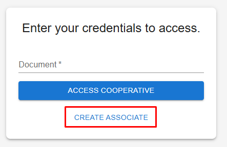
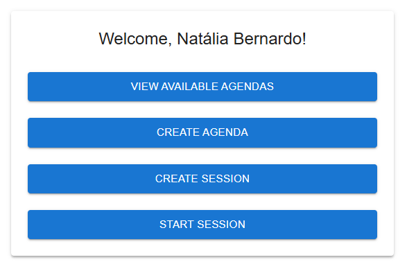
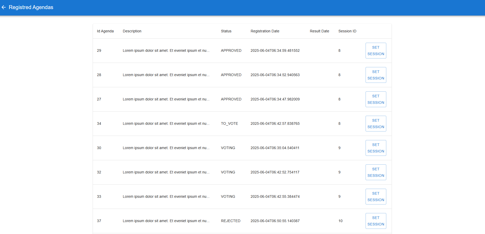
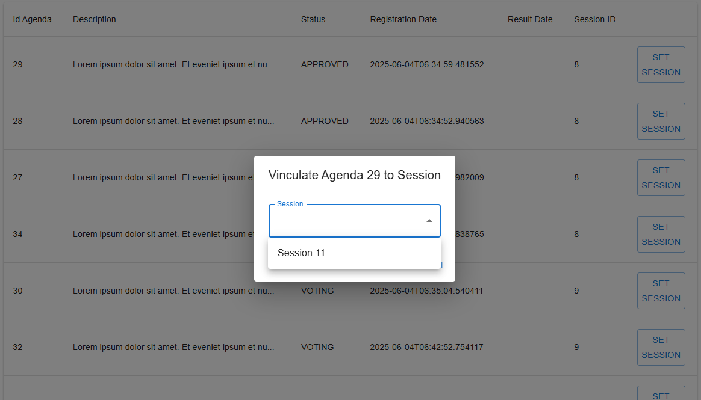
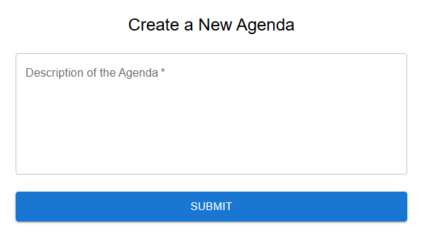
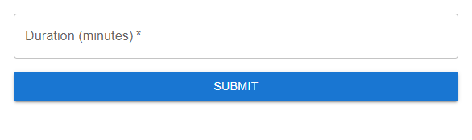
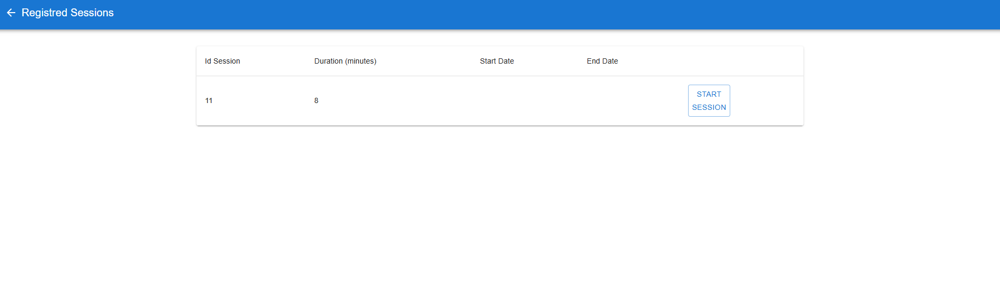
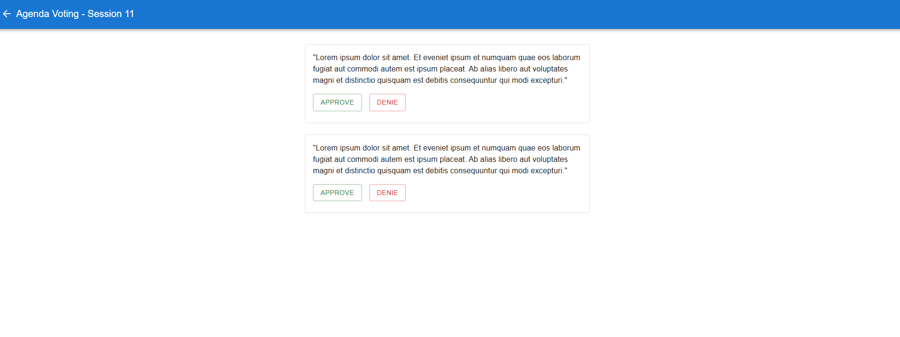

## Estrutura do projeto:
Utilizado Spring Boot, conforme solicitado,e como persistência foi utilizado o Banco PostgreSQL.
 
A aplicação foi subida numa instância EC2 da AWS, com conexão com o Banco através de RDS.
 
O script para criar o banco usado neste projeto se encotra no diretório ``resources/script/script_create_database.sql``.
 
O FrontEnd da Aplicação foi todo feito em React, utilizando estilizações simples através dos componentes da Material UI.
 
 
É possível realizar o cadastro de Associados através dessa opção, e a opção acima vai permitir que o usuário acesse inserindo apenas um CPF já cadastrado.

No Menu abaixo, ficam as opções da Aplicação. Na primeira opção, podemos realizar a verificação de quais pautas estão cadastradas, e também é possível atribuir elas a uma Sessão, para que seja votada.

Também é possível fazer o cadastro de Pautas e Sessões pelo mesmo menu.

Na opção de iniciar Sessões, é possível ver todas as Sessões cadastradas, assim como iniciar Sessões para votação e verificar como ficou a votação de cada Pauta quando ela se encerra.

A instância que roda do Backend vai ficar desligada para evitar consumo excessivo, então podem entrar em contato comigo para a realização dos testes.
